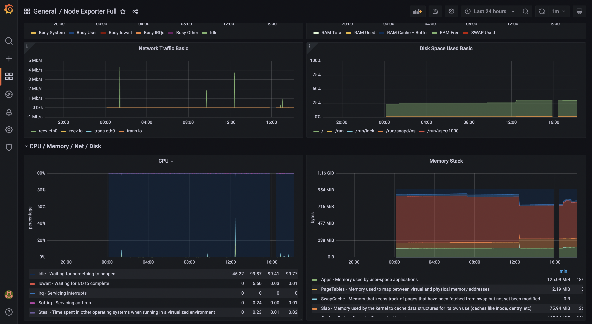

# monitoring

## Points to be covered
1. Pre-requisites
2. Installations
3. Custom Configurations
4. Future enhancement

### 1. Pre-requisites:
- Base Image: Canonical, Ubuntu, 20.04 LTS, amd64 focal image build on 2022-04-19
- Architecture: 64-bit (x86)
- Ami-Id: ami-0c4f7023847b90238
- Instance Type: t2-micro (Free tier eligible for testing)
- VPC 
- Subnet
- Security Group (Ports: SSH-22 , HTTPS-443 , CustomTCP-8080,9100,3000,9093,9090)

### 2. Installation Steps:
   1. NGINX with Prometheus-Node-Exporter & Node-Exporter
- NGINX:
```
https://www.nginx.com/blog/setting-up-nginx/
```
- Prometheus-Node-Exporter
```
https://blog.ruanbekker.com/blog/2020/04/25/nginx-metrics-on-prometheus-with-the-nginx-log-exporter/
```
- Node-Exporter:
```
https://ourcodeworld.com/articles/read/1686/how-to-install-prometheus-node-exporter-on-ubuntu-2004
```
2. Prometheus Server with Grafana-
- Prometheus:
```
https://linoxide.com/how-to-install-prometheus-on-ubuntu/
```
- Grafana:
```
https://www.liquidweb.com/kb/what-is-grafana/
```
### 3. Custom Configurations:
- **Prometheus Configuration:** With prometheus configuration file, targets are registered to monitor the NGINX server and Node-Exporter with the specified port.

- **Grafana Configuration:** In grafana we need to register the prometheus target by specifying prometheus link.

- **NODE EXPORTER DASHBOARD** Adding node-exporter dashboard , gives elaborative visualization of ec2 instance's memory,cpu,processes etc.


### 4. Future Enhancement:
- As the configuration setup supposed to be done over 10 machines , it will create redundancy for manual installation. The better solution to over-come this issue is using **Ansible** as a configuration management tool.
We will configure ansible server over ec2 instance as a master server and register other ec2 instances with master server. The simple package installation playbook/script will install required packages over all the servers.

- For monitoring the instances we will add private IP addresses of instances into targets of prometheus configuration file.

- To enable alerting over the instances, we have created custom alert_rules.yml file which will monitor instances according to provided alert expression.

- To send alerts over email we need to set up  alertmanager and need to configure with prometheus.




